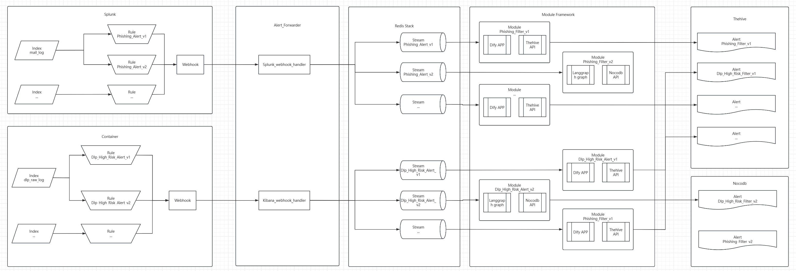

# AI SOC Framework

基于 LLM 的告警分析框架，通过模块化的方式调用Langchain/Langgraph/Dify进行告警分析

## 功能

* **模块化引擎**: 动态加载和执行告警分析模块
* **LLM集成**:
    * **LLM接口**: 包含Dify和Langgraph的集成接口及样例模块
    * **工单接口**: 包含Thehive/Nocodb/nocoly的集成接口及样例模块
* **事件驱动**: 使用 Redis Stream 作为消息总线，实现模块化告警流式处理

## 架构图



## 快速开始

### 1. 环境准备

* Python 3.12+
* Docker 和 Docker Compose (用于运行 Redis Stack)

### 2. 开发环境

1. **克隆项目**
   ```bash
   git clone https://github.com/FunnyWolf/ai-soc-framework
   cd ai-soc-framework
   ```

2. **安装依赖**
   建议在虚拟环境中使用 pip 安装依赖：
   ```bash
   python -m venv venv
   source venv/bin/activate  
   pip install -r requirements.txt
   ```

3. **启动依赖服务**
   项目使用 Redis 作为消息队列。我们提供了 Docker Compose 文件来快速启动一个 Redis Stack 实例。
   ```bash
   cd Docker/redis_stack
   docker-compose up -d
   ```

4. **配置**
   复制配置文件模板，并根据您的环境修改 `CONFIG.py` 文件，填入各个服务的 API 密钥、URL 和其他必要参数。
   ```bash
   cp CONFIG.example.py CONFIG.py
   ```
5. **启动 Forwarder**
   Forwarder 负责将SIEM的 Webhook 推送的告警数据写入 Redis Stream (当前适配Splunk和ELK)
   ```bash
    cd Forwarder
    python app.py
   ```

5. **运行**
   完成上述步骤后，在项目根目录运行主程序：

    ```bash
    python main.py
    ```

   程序将启动核心引擎，加载 `MODULES` 目录下的所有模块，并开始监听和处理事件。

## 模块开发

您可以参考 `MODULES` 目录下的现有模块，开发自己的自动化流程。每个模块都是一个独立的 Python 文件，框架会自动加载并运行它。

## TODO

## 许可证

该项目采用 [MIT](https://choosealicense.com/licenses/mit/) 许可证。

