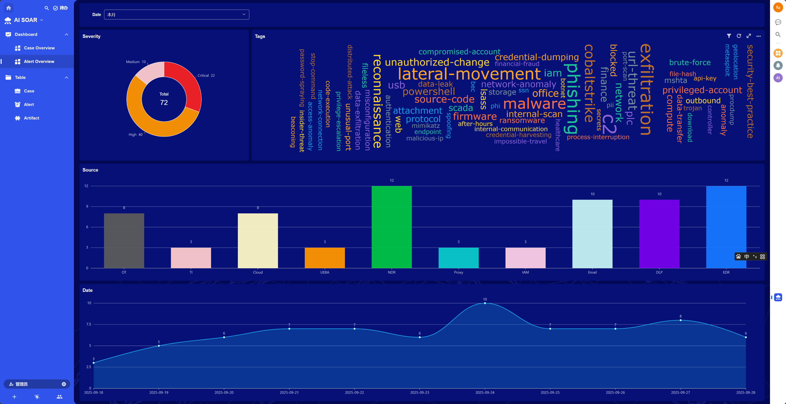
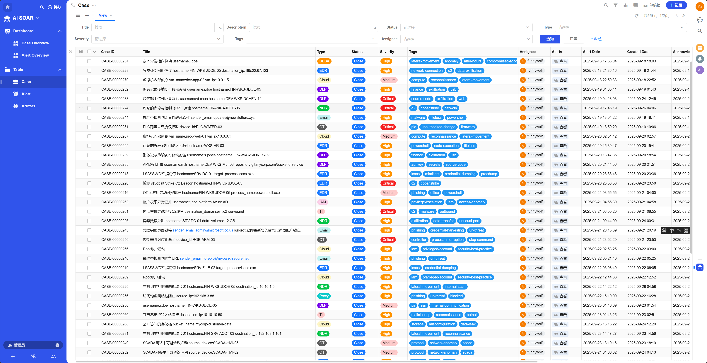

# AI SOC Framework (ASF)

基于AI Agent的SOC自动化框架.灵活,强大,本地部署.

## 功能

- 基于Webhook + Redis Stream的告警流水线,支持主流SIEM平台
- 提供Langchain/Langgraph/Dify等AI Agent模块模板,快速开发Pre Automation/Post Automation模块
- 内置功能齐全的工单平台(AI SOAR),支持Artifact->Alert->Case网络安全告警数据模型
- AI SOAR内置简单易用的告警聚合功能,支持默认规则和自定义规则
- 框架代码皆为Python编写,易于二次开发和扩展

### AI SOAR Dashboard




### AI SOAR Case Table




### AI SOAR Alert Table


### AI SOAR Artifact Table


### Redis Alert Stream


## 为什么使用ASF & ASF解决哪些问题

- 预算/资源有限无法购买商用SOAR产品

> ASF完全开源免费,且支持对接社区版的ELK(SIEM),企业只需有基础的安全设备和日志采集能力即可构建完整的SOC基础设施

- 所有网络安全相关数据不允许离开企业内网

> ASF所有组件(AI SOAR/Redis Stack/Module Framework)均可本地部署,可以通过vllm/ollama等部署本地化的LLM,实现完全本地化的AI
> Agent能力

- 对于工单管理有大量定制化需求,不限于个性化UI,定制化流程,自定义数据模型,数据报表等

> ASF的AI SOAR基于[Nocoly](https://www.nocoly.com/)构建,无需编写代码即可实现定制化UI修改,自定义工作流,自定义报表等

- 出于特定的安全业务需求或提高效率,需要定制化的AI Agent分析告警

> ASF提供模块模板及样例模块,用户可根据自身需求快速开发定制化的AI Agent模块,支持多框架(Langchain/Langgraph/Dify等)

- 内部系统/设备接口众多,需要额外的数据处理及转化,主流的SOAR(如Swimlane/Splunk SOAR)或可视化编排产品(n8n)等无法满足需求

> ASF的模块开发完全基于Python,用户可以使用任何Python库,并且可以灵活地对接任何API或设备

- SOAR的自动化剧本和自定义的自动化脚本无法调试

> ASF中有用于调试的适配性代码,用户可单独运行模块对指定告警(Redis Insight检索查看)进行调试,而无需启动整个框架

## 不适用于哪些场景

- 安全团队没有基础的Python开发能力

> ASF不是开箱即用平台,需要一定的Python开发能力来进行模块开发和定制化

- 企业使用单独厂商一揽子解决方案(如XDR/MDR/MSS等)

> ASF需要告警数据或日志来进行自动化分析,XDR/MDR/MSS等封闭系统无法实现

- 企业没有基础的安全设备和日志采集能力

> 没有设备就没有日志和告警,那也就不需要自动化

## 架构图


## 快速开始

### 1. 环境准备

* Python 3.12+
* Docker 和 Docker Compose (用于运行 Redis Stack)

### 2. 开发环境

1. **克隆项目**
   ```bash
   git clone https://github.com/FunnyWolf/ai-soc-framework
   cd ai-soc-framework
   ```

2. **安装依赖**
   建议在虚拟环境中使用 pip 安装依赖：
   ```bash
   python -m venv venv
   source venv/bin/activate  
   pip install -r requirements.txt
   ```

3. **启动依赖服务**
   项目使用 Redis 作为消息队列。我们提供了 Docker Compose 文件来快速启动一个 Redis Stack 实例。
   ```bash
   cd Docker/redis_stack
   docker-compose up -d
   ```

4. **配置**
   复制配置文件模板，并根据您的环境修改 `CONFIG.py` 文件，填入各个服务的 API 密钥、URL 和其他必要参数。
   ```bash
   cp CONFIG.example.py CONFIG.py
   ```
5. **启动 Forwarder**
   Forwarder 负责将SIEM的 Webhook 推送的告警数据写入 Redis Stream (当前适配Splunk和ELK)
   ```bash
    cd Forwarder
    python app.py
   ```

5. **运行**
   完成上述步骤后，在项目根目录运行主程序：

    ```bash
    python main.py
    ```

   程序将启动核心引擎，加载 `MODULES` 目录下的所有模块，并开始监听和处理事件。

## 模块开发

您可以参考 `MODULES` 目录下的现有模块，开发自己的自动化流程。每个模块都是一个独立的 Python 文件，框架会自动加载并运行它。

## TODO

- 详细的安装和使用文档

> nocoly的部署,redis stack的部署

- 各个部分的设计思想
- uwsgi配置

## 许可证

该项目采用 [MIT](https://choosealicense.com/licenses/mit/) 许可证。

